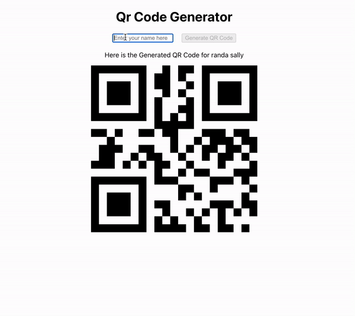

# QR-Code-Generator-Project

Defining a functional component QrCodeGenerator.
Using useState to manage two pieces of state: qrCode for storing the QR code value and input for storing the current value of the text input.
Defining a function handleGenerateQrCode that sets the qrCode state to the current input value and then clears the input state.
Rendering an input field that updates the input state on change.
Rendering a button that is enabled only if input is not empty or whitespace. When clicked, it triggers handleGenerateQrCode.
Rendering a div containing:
A paragraph displaying the text "Here is the Generated QR Code for" followed by the current qrCode value.
The QRCode component that generates a QR code based on the qrCode state
